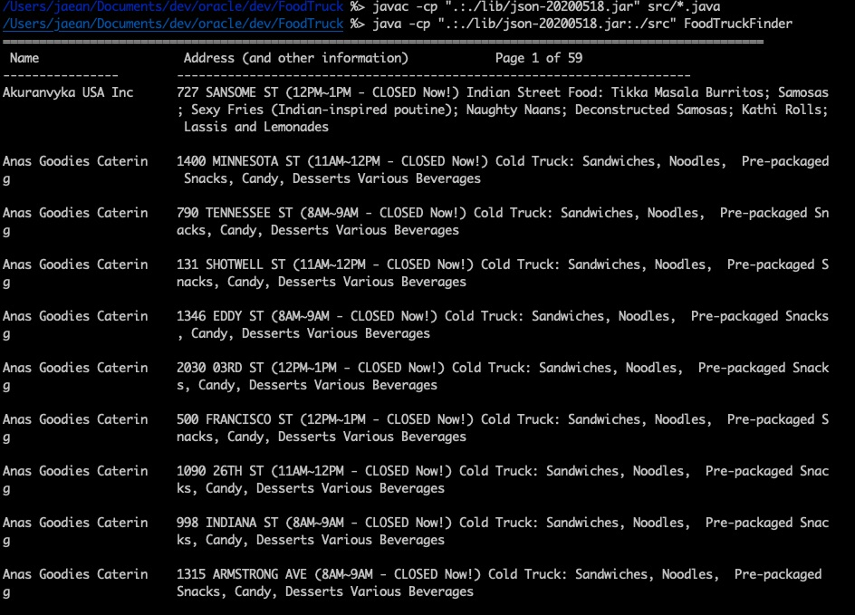

# FoodTruck
This is a very simple command-line program that will print out a list of food trucks, given a source of food truck data from the San Francisco government’s API.

## Dependency

Java version used : openjdk version "1.8.0_252"

A very small JSON library ORG.JSON was used. It is included in '/lib' folder. [For more information, please the document here](lib/README.md)

## Build

Firstly, git clone the project. <br/>
Once git cloned, just compile with the following command
```
javac -cp ".:./lib/json-20200518.jar" src/*.java
```

## Run 

```
java -cp ".:./lib/json-20200518.jar:./src" FoodTruckFinder
```



## Design considerations

The main program "FoodTruckFinder" has two different implementations.  The first one calls Socrata API for each pagination.  
```
	DirectAPICallPresenter presenter = new DirectAPICallPresenter();

```

The second one executes the query for all the food trucks for the day and keeps the results in memory with an assumption that the program is to be used as a backend service. The result dataset is less than 1MB in size. Given the small size of the dataset, it can be kept in memory with ease on system resources. Since Socrata API is rate limited, keeping the query result in memory makes more sense for scalability and latency purpose. However, the cache should be refreshed on a daily base. 

```
	CachedPresenter presenter = new CachedPresenter();

```
